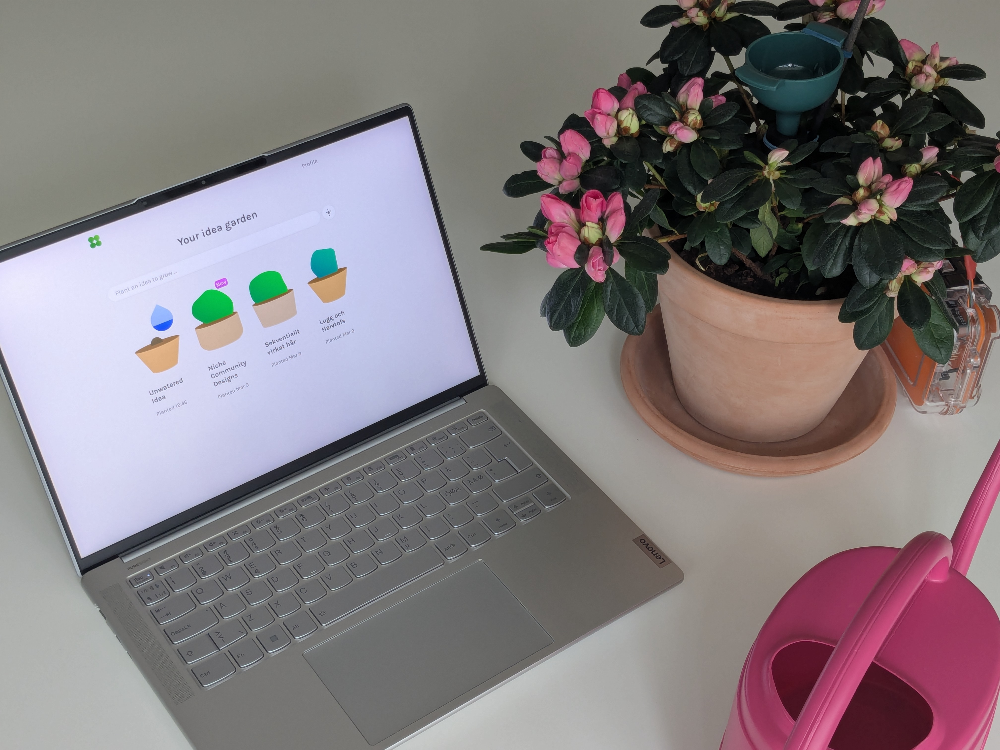
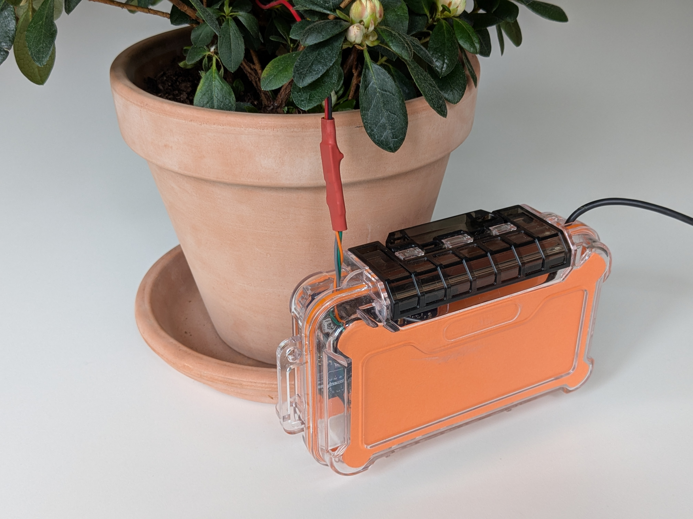
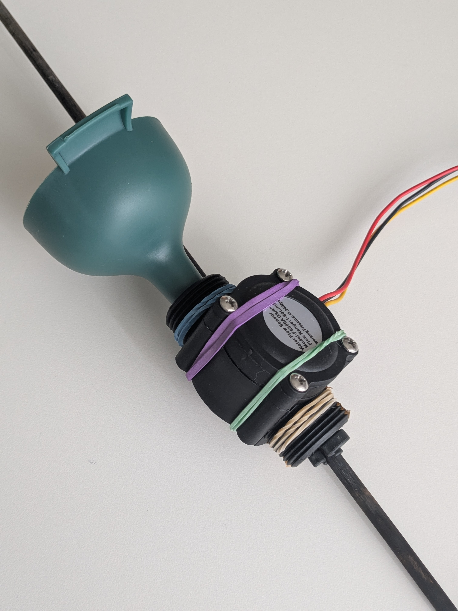
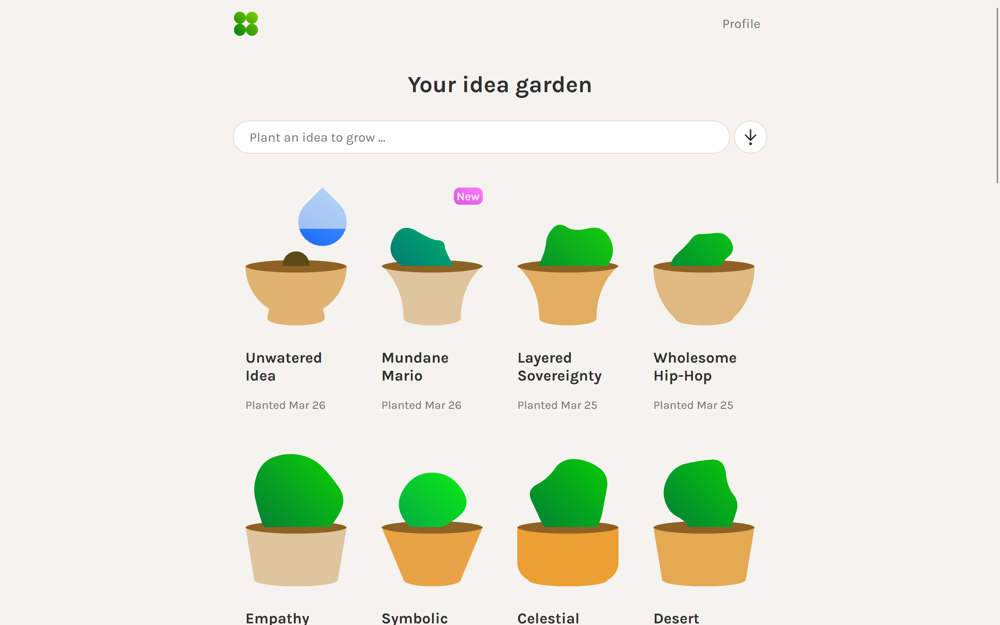
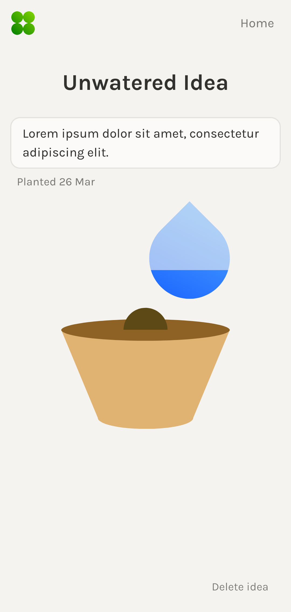
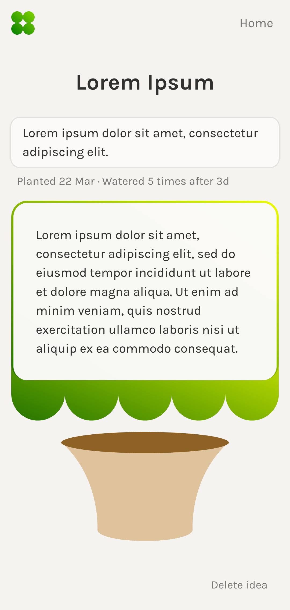
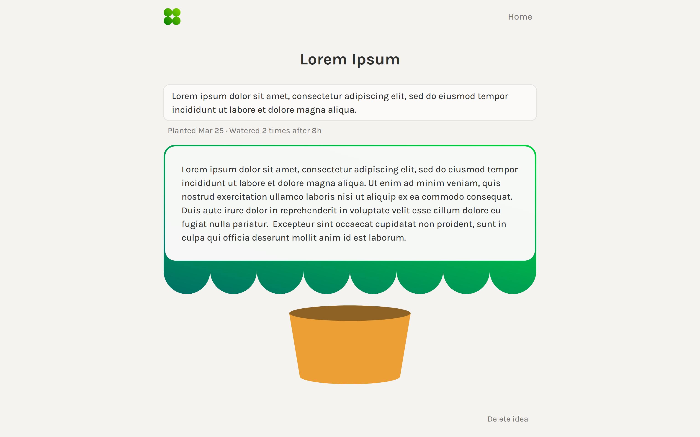

<p align="center"></p>

<h1 align="center">Ideaflower</h1>

Research through design for my master's thesis in interactive media technology.

I use water as a conceptual link between plant, AI, and broader ecologies. Practically, the user waters a houseplant the same amount as an AI response consumes, in order to get the response. I use an estimate of [50 ml](https://doi.org/10.1145/3724499) for an average medium-sized response with ChatGPT-3, excluding model training. The user "plants" ideas, and the AI responses constitute "growth" of these, allowing for a process of "gardening ideas".

The purpose of the project was to explore how plants can be incorporated in interaction with creative AI, in order to make the interaction more caring and grounded in natural rhythms. It led to a design concept I call _phytomorphic AI interaction_: designing the interaction form of AI systems with plant-based qualities, relations, and temporalities.

## Preview

<p>
  
  
</p>

<p>
  
  
</p>

<p>
  
  
</p>

<p>
  
  
</p>

## Hardware

- [Arduino Uno WiFi Rev2](https://docs.arduino.cc/hardware/uno-wifi-rev2/)
- [G3&4" Water Flow sensor](https://www.seeedstudio.com/G3-4-Water-Flow-Sensor-p-1083.html)

## Software

Arduino:

- [WiFiNINA](https://docs.arduino.cc/libraries/wifinina/)
- [FlowSensor](https://github.com/hafidhh/FlowSensor-Arduino/)
- [FirebaseArduino](https://github.com/Rupakpoddar/FirebaseArduino/)

Web:

- [Vue](https://vuejs.org/), [Vite](https://vite.dev/), [Vue Router](https://router.vuejs.org/), [Pinia](https://pinia.vuejs.org/), [VueUse](https://vueuse.org/)
- [Firebase](https://firebase.google.com/) database and hosting
- [OpenAI](https://developers.openai.com/api/docs), [GPT-4.1](https://developers.openai.com/api/docs/models/gpt-4.1)
- [Blobshape](https://github.com/lokesh-coder/blobshape) shape generator
- [Lucide](https://lucide.dev/) icons

## Usage

Note that the prototype currently only supports one user at a time as active carer, set via Firebase `flowModel/common/carerUsername`.

## Develop

```
npm install
firebase init
npm run dev
```

Add your Firebase keys to `ideagarden/persistance/firebaseConfig.js`:

```js
const firebaseConfig = {...};
export const USER_PASSWORD = "<PASSWORD>";
export default firebaseConfig;
```

and `Ideaflower/firebaseSecrets.h`:

```cpp
#define FIREBASE_URL "<KEY>"
#define FIREBASE_AUTH "<KEY>"
```

Add your wifi keys to `Ideaflower/wifiSecrets.h`:

```cpp
#define WIFI_SSID "<KEY>"
#define WIFI_PASSWORD "<KEY>"
```

## Deploy

```
npm run build
firebase deploy
```
